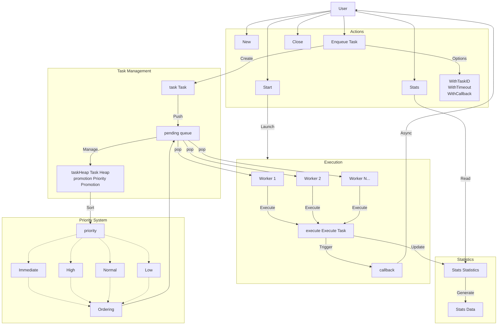
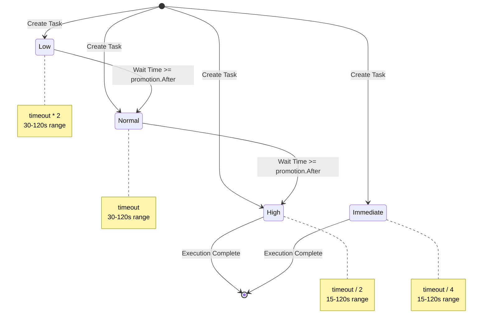

```mermaid
graph TB
  User[User]

  subgraph "Actions"
    New[New]
    Start[Start]
    Enqueue[Enqueue Task]
    Close[Close]
    Stats[Stats]
    Options[WithTaskID<br>WithTimeout<br>WithCallback]
  end

  subgraph "Task Management"
    Pending[pending queue]
    TaskHeap[taskHeap Task Heap<br>promotion Priority Promotion]
    Task[task Task]
  end

  subgraph "Execution"
    Worker1[Worker 1]
    Worker2[Worker 2]
    WorkerN[Worker N...]
    Execute[execute Execute Task]
    Callback[callback]
  end

  subgraph "Priority System"
    Priority[priority]
    Immediate[Immediate]
    High[High]
    Normal[Normal]
    Low[Low]
    InsertAt[Ordering]
  end

  subgraph "Statistics"
    AtomicStats[Stats Statistics]
    StatsData[Stats Data]
  end

  User --> New
  User --> Start
  User --> Enqueue
  User --> Close
  User --> Stats

  Callback --> |Async| User

  Start -->|Launch| Execution

  Enqueue -->|Options| Options
  Enqueue -->|Create| Task
  Task -->|Push| Pending
  
  Pending -->|Manage| TaskHeap
  InsertAt --> Pending
  TaskHeap -->|Sort| Priority

  Priority -.-> Immediate
  Priority -.-> High
  Priority -.-> Normal
  Priority -.-> Low

  Immediate -.-> InsertAt
  High -.-> InsertAt
  Normal -.-> InsertAt
  Low -.-> InsertAt

  Pending --> |pop| Worker1
  Pending --> |pop| Worker2
  Pending --> |pop| WorkerN

  Worker1 -->|Execute| Execute
  Worker2 -->|Execute| Execute
  WorkerN -->|Execute| Execute

  Execute -->|Update| AtomicStats
  Execute -->|Trigger| Callback

  Stats -->|Read| AtomicStats
  AtomicStats -->|Generate| StatsData
```

## Priority Promotion

```mermaid
stateDiagram
  [*] --> Low: Create Task
  [*] --> Normal: Create Task
  [*] --> High: Create Task
  [*] --> Immediate: Create Task
  
  Low --> Normal: Wait Time >= promotion.After
  Normal --> High: Wait Time >= promotion.After
  High --> [*]: Execution Complete
  Immediate --> [*]: Execution Complete
  
  note right of Low
    timeout * 2
    30-120s range
  end note
  
  note right of Normal
    timeout
    30-120s range
  end note
  
  note right of High
    timeout / 2
    15-120s range
  end note
  
  note right of Immediate
    timeout / 4
    15-120s range
  end note
```
