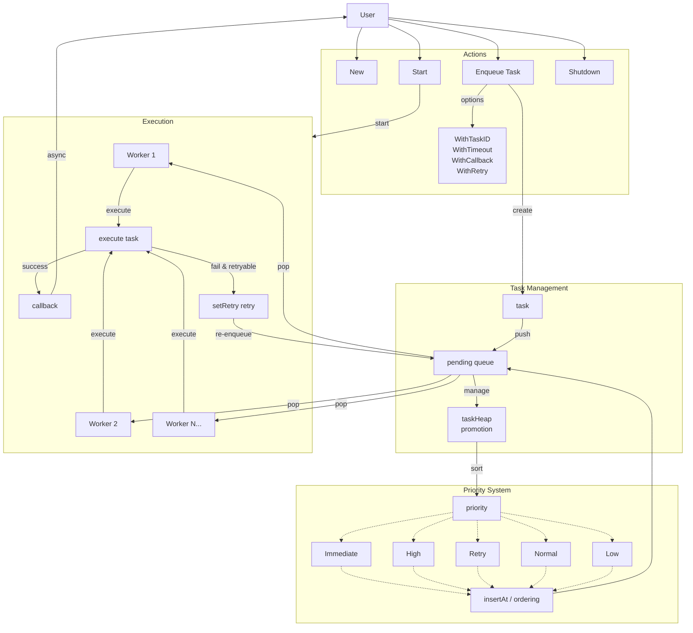
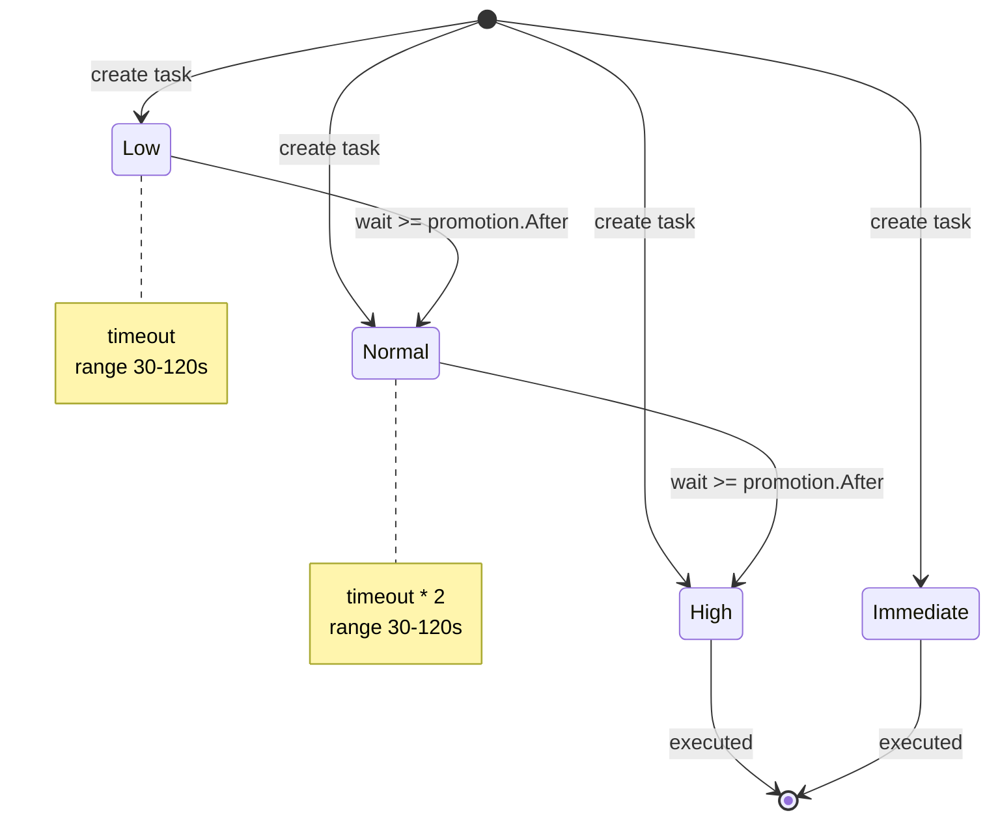
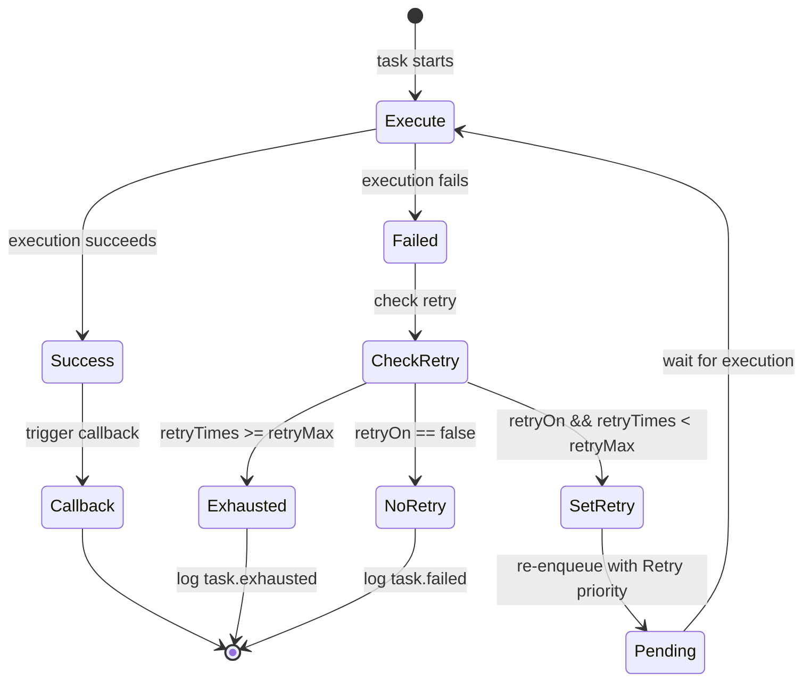

> [!NOTE]
> This README was translated by ChatGPT 5-mini
# Go Task Queue

> Lightweight Golang priority queue that supports bounded concurrency, priority promotion, error retry, and graceful shutdown. Maximizes hardware utilization and prevents system overload.  
> Suitable for scenarios that need controlled concurrent task execution with priority scheduling.

[](https://pkg.go.dev/github.com/pardnchiu/go-queue)
[](https://goreportcard.com/report/github.com/pardnchiu/go-queue)
[](https://app.codecov.io/github/pardnchiu/go-queue/tree/master)
[](https://github.com/pardnchiu/go-queue/releases)
[](LICENSE)

- [Core Features](#core-features)
  - [Bounded Concurrency](#bounded-concurrency)
  - [Priority Queue and Promotion](#priority-queue-and-promotion)
  - [Error Retry](#error-retry)
- [Flowchart](#flowchart)
- [Usage](#usage)
  - [Installation](#installation)
  - [Initialization](#initialization)
    - [Basic Usage](#basic-usage)
    - [Using Preset Configs](#using-preset-configs)
    - [Using Options](#using-options)
    - [Using Retry](#using-retry)
- [Configuration](#configuration)
- [Priority Levels](#priority-levels)
- [Available Functions](#available-functions)
  - [Queue Management](#queue-management)
  - [Enqueue Options](#enqueue-options)
- [Priority Promotion](#priority-promotion-1)
- [Retry Mechanism](#retry-mechanism)
- [Timeout Mechanism](#timeout-mechanism)
- [Use Cases](#use-cases)
- [License](#license)
- [Author](#author)
- [Stars](#stars)

## Core Features

### Bounded Concurrency
Configurable worker pool size (default: CPU cores × 2). Tasks beyond worker capacity queue up to avoid system overload while maximizing hardware utilization.

### Priority Queue and Promotion
A five-level priority system implemented with a min-heap (Immediate > High > Retry > Normal > Low). Higher-priority tasks execute first; tasks with the same priority are processed FIFO.
Tasks that wait for a long time are automatically promoted to a higher priority to prevent starvation. Promotion thresholds are calculated based on configured timeouts.

### Error Retry
When a task fails, it can be automatically retried. Retry tasks are re-enqueued with `Retry` priority, which is between `High` and `Normal`, providing a delayed retry effect.

## Flowchart

<details>
<summary>Main Flow</summary>



</details>

<details>
<summary>Priority Promotion</summary>



</details>

<details>
<summary>Retry Flow</summary>



</details>

## Usage

### Installation

> [!NOTE]
> The latest commit may change; using tagged versions is recommended.  
> Commits that only change documentation may be rebased later.

```bash
go get github.com/pardnchiu/go-queue@[VERSION]

git clone --depth 1 --branch [VERSION] https://github.com/pardnchiu/go-queue.git
```

### Initialization

#### Basic Usage
```go
package main

import (
  "context"
  "fmt"
  "time"
  
  queue "github.com/pardnchiu/go-queue"
)

func main() {
  // Initialize with default config
  q := queue.New(nil)
  
  // Start queue workers
  ctx := context.Background()
  q.Start(ctx)
  
  // Enqueue tasks
  for i := 0; i < 10; i++ {
  id, err := q.Enqueue(ctx, "", func(ctx context.Context) error {
    fmt.Println("task executed")
    return nil
  })
  if err != nil {
    fmt.Printf("enqueue failed: %v\n", err)
  }
  fmt.Printf("task ID: %s\n", id)
  }
  
  // Graceful shutdown (wait for all tasks to finish)
  if err := q.Shutdown(ctx); err != nil {
  fmt.Printf("shutdown error: %v\n", err)
  }
}
```

#### Using Preset Configs
```go
package main

import (
  "context"
  "fmt"
  
  queue "github.com/pardnchiu/go-queue"
)

func main() {
  q := queue.New(&queue.Config{
  Workers: 8,
  Size:    1000,
  Timeout: 60,
  Preset: map[string]queue.PresetConfig{
    "critical": {Priority: "immediate", Timeout: 15},
    "email":    {Priority: "high", Timeout: 30},
    "report":   {Priority: "normal", Timeout: 120},
    "cleanup":  {Priority: "low", Timeout: 300},
  },
  })
  
  ctx := context.Background()
  q.Start(ctx)
  defer q.Shutdown(ctx)
  
  // Use preset config for critical payment
  q.Enqueue(ctx, "critical", func(ctx context.Context) error {
  return processPayment()
  })
  
  // Use preset config to send email
  q.Enqueue(ctx, "email", func(ctx context.Context) error {
  return sendNotification()
  })
  
  // Use preset config to generate report
  q.Enqueue(ctx, "report", func(ctx context.Context) error {
  return generateReport()
  })
}
```

#### Using Options
```go
package main

import (
  "context"
  "fmt"
  "time"
  
  queue "github.com/pardnchiu/go-queue"
)

func main() {
  q := queue.New(&queue.Config{Workers: 4})
  
  ctx := context.Background()
  q.Start(ctx)
  defer q.Shutdown(ctx)
  
  // Custom task ID
  q.Enqueue(ctx, "", func(ctx context.Context) error {
  return processOrder("ORD-123")
  }, queue.WithTaskID("order-ORD-123"))
  
  // Custom timeout
  q.Enqueue(ctx, "", func(ctx context.Context) error {
  return heavyComputation()
  }, queue.WithTimeout(5*time.Minute))
  
  // Custom callback (only triggered on success)
  q.Enqueue(ctx, "", func(ctx context.Context) error {
  return sendEmail()
  }, queue.WithCallback(func(id string) {
  fmt.Printf("task %s completed\n", id)
  }))
  
  // Combined options
  q.Enqueue(ctx, "", func(ctx context.Context) error {
  return importData()
  },
  queue.WithTaskID("import-daily"),
  queue.WithTimeout(10*time.Minute),
  queue.WithCallback(func(id string) {
    logSuccess(id)
  }),
  )
}
```

## Configuration

```go
type Config struct {
  Workers int                     // worker pool size (default: CPU cores × 2)
  Size    int                     // max queue capacity (default: Workers × 64)
  Timeout int                     // default timeout in seconds (default: 30)
  Preset  map[string]PresetConfig // named preset configs
}

type PresetConfig struct {
  Priority string // "immediate", "high", "normal", "low" (default: "normal")
  Timeout  int    // override timeout in seconds (0 = computed by priority)
}
```

## Priority Levels

| Priority   | Value | Timeout Calculation        | Use Case            |
|------------|-------|----------------------------|---------------------|
| Immediate  | 0     | timeout / 4 (15-120s)      | Payments, alerts    |
| High       | 1     | timeout / 2 (15-120s)      | User-initiated ops  |
| Retry      | 2     | timeout / 2 (15-120s)      | Failed task retry (internal use) |
| Normal     | 3     | timeout (15-120s)          | Background tasks    |
| Low        | 4     | timeout × 2 (15-120s)      | Cleanup, analytics  |

> **Note**: `Retry` priority is managed internally by the system and cannot be directly specified by users.

## Available Functions

### Queue Management

- `New(config)` - create a new queue instance
  ```go
  q := queue.New(&queue.Config{
  Workers: 4,
  Size:    256,
  Timeout: 60,
  })
  ```

- `Start(ctx)` - start the worker pool
  ```go
  q.Start(ctx)
  ```

- `Enqueue(ctx, preset, action, options...)` - add a task to the queue
  ```go
  id, err := q.Enqueue(ctx, "email", func(ctx context.Context) error {
  return sendEmail()
  })
  ```

- `Shutdown(ctx)` - graceful shutdown
  ```go
  // wait indefinitely for all tasks to finish
  err := q.Shutdown(context.Background())
  
  // with timeout
  ctx, cancel := context.WithTimeout(context.Background(), 30*time.Second)
  defer cancel()
  err := q.Shutdown(ctx)
  ```

### Enqueue Options

- `WithTaskID(id)` - set a custom task ID
  ```go
  queue.WithTaskID("unique-task-id")
  ```

- `WithTimeout(duration)` - set task timeout
  ```go
  queue.WithTimeout(5 * time.Minute)
  ```

- `WithCallback(fn)` - set completion callback (only triggered on success)
  ```go
  queue.WithCallback(func(id string) {
  // called asynchronously after task succeeds
  })
  ```

- `WithRetry(maxRetry)` - enable error retry
  ```go
  // use default max retries (3)
  queue.WithRetry(nil)
  
  // specify max retries
  maxRetry := 5
  queue.WithRetry(&maxRetry)
  ```

## Priority Promotion

Waiting tasks in the queue are automatically promoted to prevent starvation:

| Original Priority | Promotion Target | Wait Threshold                         |
|-------------------|------------------|----------------------------------------|
| Low               | Normal           | clamp(timeout, 30s, 120s)              |
| Normal            | High             | clamp(timeout × 2, 30s, 120s)          |
| Retry             | -                | no promotion (managed by retry mechanism) |
| High              | -                | no promotion (already high priority)   |
| Immediate         | -                | no promotion (highest priority)        |

Promotion is checked each time a worker pops a task from the queue.

## Retry Mechanism

When `WithRetry` is enabled, failed tasks are automatically retried:

| Stage | Behavior |
|-------|----------|
| Failed and `retryTimes < retryMax` | Re-enqueued with `Retry` priority |
| Failed and `retryTimes >= retryMax` | Log `task.exhausted`, terminate task |
| Success | Trigger callback (if configured) |

**Retry Characteristics**:
- Retry tasks have `Retry` priority, which is between `High` and `Normal`
- Each retry resets `startAt`, entering the end of the queue (within same priority)
- `Retry` priority does not participate in automatic promotion to avoid interfering with normal priority scheduling
- Default max retries is 3, customizable via `WithRetry(&maxRetry)`

## Timeout Mechanism

- Each task has a timeout based on priority or explicit configuration.
- Use `WithTimeout` to override the default timeout.
- On timeout:
  - the task's context is canceled
  - an error is logged
  - if retry is enabled, it's treated as a failure and retry is attempted
  - goroutine leak detection: if the task doesn't respond to cancellation within 5 seconds, a warning is emitted

## Use Cases

| Use Case           | Configuration                     |
|--------------------|-----------------------------------|
| API background jobs | Workers: CPU×2, Timeout: 30s     |
| Email/notifications | Priority: High, Timeout: 60s     |
| Report generation   | Priority: Normal, Timeout: 300s  |
| Data cleanup        | Priority: Low, Timeout: 600s    |
| Payment processing  | Priority: Immediate, Timeout: 15s|

Works well integrated with [go-scheduler](https://github.com/pardnchiu/go-scheduler):
```go
// Scheduler triggers, Queue controls concurrency
scheduler.Add("@every 1m", func() error {
  orders := db.GetPendingOrders()
  for _, o := range orders {
  queue.Enqueue(ctx, "order", func(ctx context.Context) error {
    return processOrder(o)
  })
  }
  return nil
})
```

## License

This project is licensed under [MIT](LICENSE).

## Author


<h4 style="padding-top: 0">邱敬幃 Pardn Chiu</h4>

<a href="mailto:dev@pardn.io" target="_blank">
  
</a> <a href="https://linkedin.com/in/pardnchiu" target="_blank">
  
</a>

## Stars

[](https://www.star-history.com/#pardnchiu/go-queue&Date)

***

©️ 2025 [邱敬幃 Pardn Chiu](https://pardn.io)
