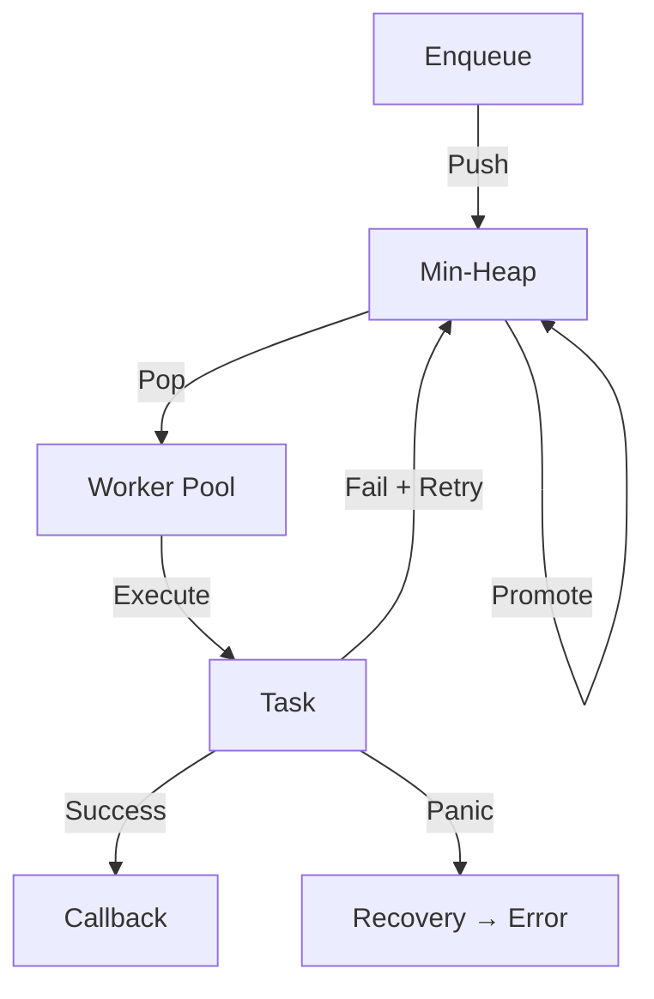

> [!NOTE]
> This README was generated by [SKILL](https://github.com/pardnchiu/skill-readme-generate), get the ZH version from [here](./README.zh.md).

# go-queue

[](https://pkg.go.dev/github.com/pardnchiu/go-queue)
[](https://goreportcard.com/report/github.com/pardnchiu/go-queue)
[](https://app.codecov.io/github/pardnchiu/go-queue/tree/master)
[](LICENSE)
[](https://github.com/pardnchiu/go-queue/releases)

> A min-heap based priority task queue with automatic promotion, retry, and panic recovery, designed for Go concurrency workloads.

## Table of Contents

- [Features](#features)
- [Architecture](#architecture)
- [File Structure](#file-structure)
- [License](#license)
- [Author](#author)
- [Stars](#stars)

## Features

> `go get github.com/pardnchiu/go-queue` · [Documentation](./doc.md)

### Five-Level Priority Scheduling with Auto-Promotion

Tasks are scheduled through a min-heap across five priority levels: Immediate, High, Retry, Normal, and Low. Low-priority tasks automatically promote to higher levels after exceeding a configurable wait threshold, eliminating starvation without manual intervention.

### Atomic State Machine Lifecycle

Queue state transitions from Created to Running to Closed are driven entirely by `atomic.CompareAndSwap`, avoiding mutexes on the Start and Shutdown paths. This ensures safe concurrent access from multiple goroutines with minimal latency.

### Built-in Retry with Panic Recovery

Each task supports a configurable retry limit; failed tasks re-enter the heap at Retry priority. Workers automatically recover from panics and convert them to error reports, preventing a single task crash from taking down the entire worker pool.

## Architecture


```mermaid
graph TB
    E[Enqueue] -->|Push| H[Min-Heap]
    H -->|Pop| W[Worker Pool]
    W -->|Execute| T[Task]
    T -->|Fail + Retry| H
    H -->|Promote| H
    T -->|Success| CB[Callback]
    T -->|Panic| R[Recovery → Error]
```

## File Structure

```
go-queue/
├── new.go              # Queue construction, worker startup and shutdown
├── task.go             # Task struct and min-heap implementation
├── pending.go          # Pending queue, push/pop and auto-promotion
├── priority.go         # Priority level definitions and timeout calculation
├── option.go           # Enqueue options (TaskID, Timeout, Callback, Retry)
├── main_test.go        # Tests
├── go.mod
└── LICENSE
```

## License

This project is licensed under the [MIT LICENSE](LICENSE).

## Author


<h4 style="padding-top: 0">邱敬幃 Pardn Chiu</h4>

<a href="mailto:dev@pardn.io" target="_blank">

</a> <a href="https://linkedin.com/in/pardnchiu" target="_blank">

</a>

## Stars

[](https://www.star-history.com/#pardnchiu/go-queue&Date)

***

©️ 2025 [邱敬幃 Pardn Chiu](https://linkedin.com/in/pardnchiu)
