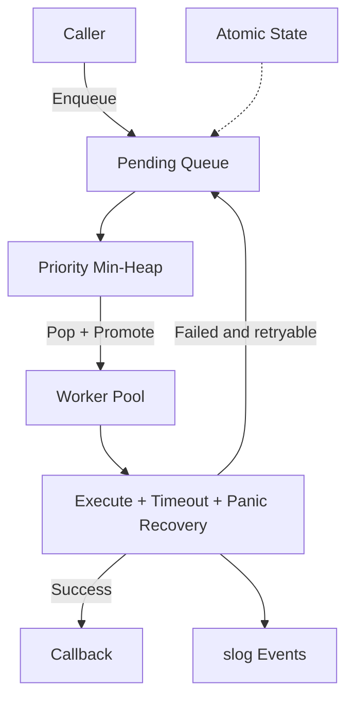

> [!NOTE]
> This README was generated by [SKILL](https://github.com/agenvoy/skill-readme-generate), get the ZH version from [here](./doc/README.zh.md).

***

<strong>PRIORITY TASKS THAT NEVER STARVE!</strong>

***

> A Go priority task queue with anti-starvation promotion, priority-scaled timeouts, and graceful drain shutdown

## Table of Contents

- [Features](#features)
- [Architecture](#architecture)
- [License](#license)
- [Author](#author)

## Features

> `go get github.com/pardnchiu/go-queue` · [Documentation](./doc/doc.md)

- **Five-Level Priority Heap** — Immediate, High, Retry, Normal, and Low share one min-heap, with FIFO ordering inside each level.
- **Anti-Starvation Promotion** — Low and Normal tasks promote automatically after a wait threshold, so bursts of high-priority work never starve them.
- **Preset-Driven Timeouts** — Named presets bind a priority and a base timeout, and the effective timeout scales by priority within a 15–120 second window.
- **Retry and Panic Isolation** — Failed tasks re-enter at a dedicated Retry priority, and panics become errors instead of killing the worker pool.
- **Atomic Lifecycle** — CAS drives the Created → Running → Closed transitions, and `Shutdown` drains remaining tasks under a caller-supplied deadline.

## Architecture

> [Full Architecture](./doc/architecture.md)

```mermaid
graph TB
    C[Caller] -->|Enqueue| P[Pending Queue]
    P --> H[Priority Min-Heap]
    H -->|Pop + Promote| W[Worker Pool]
    W --> E[Execute + Timeout + Panic Recovery]
    E -->|Failed and retryable| P
    E -->|Success| CB[Callback]
    E --> L[slog Events]
    S[Atomic State] -.-> P
```

## License

This project is licensed under the [MIT LICENSE](LICENSE).

## Author

Just [open an issue](https://github.com/pardnchiu/go-queue/issues/new) to share an idea.

***

©️ 2025 [邱敬幃 Pardn Chiu](https://www.linkedin.com/in/pardnchiu)
