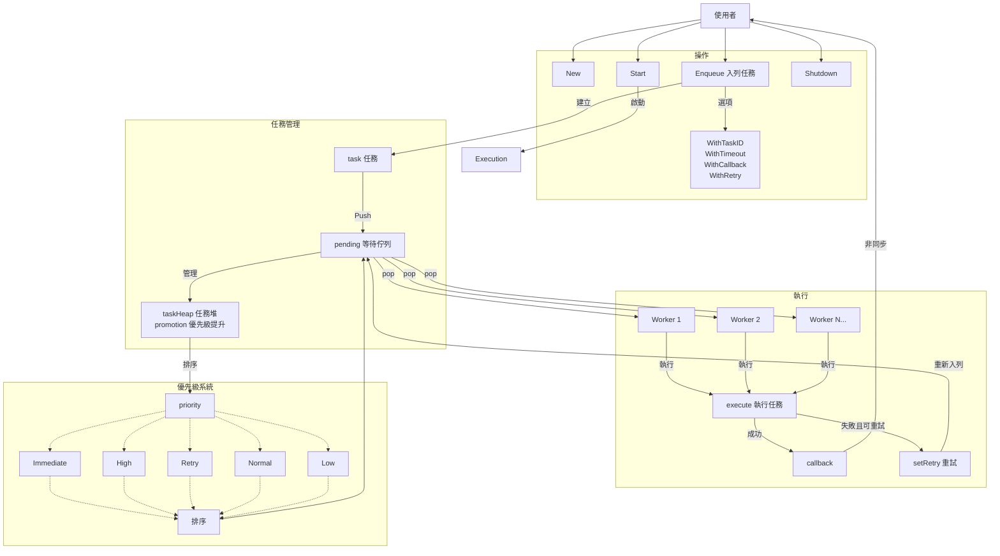
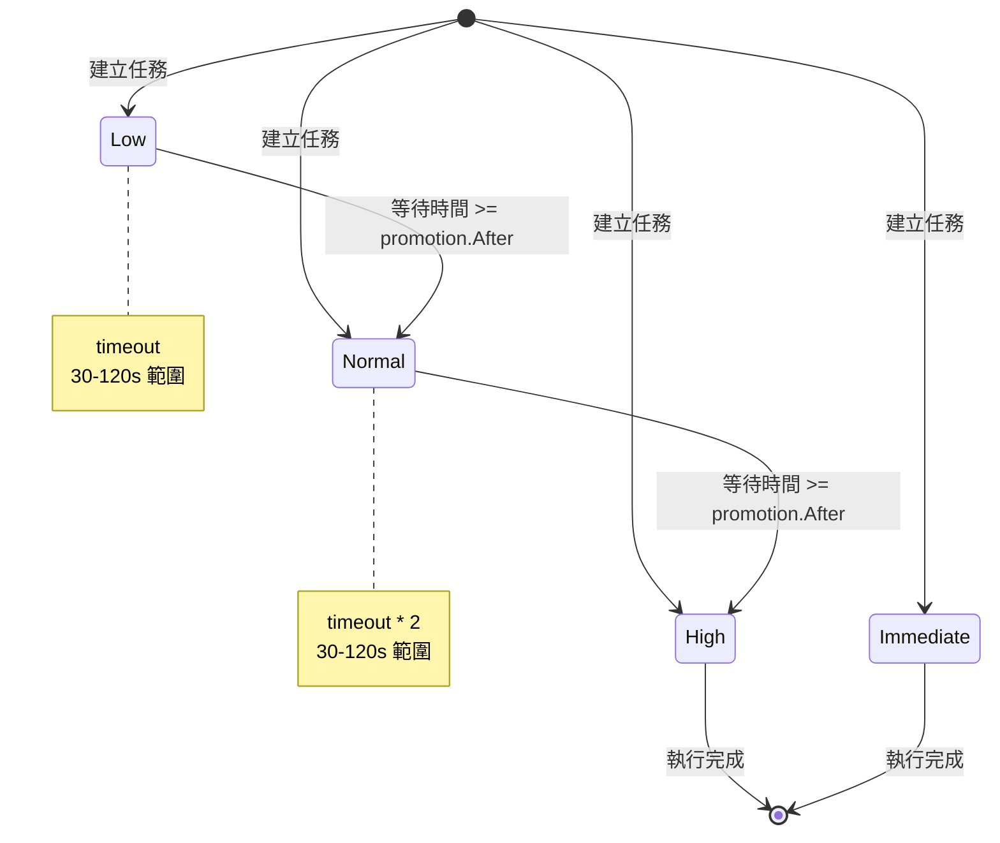
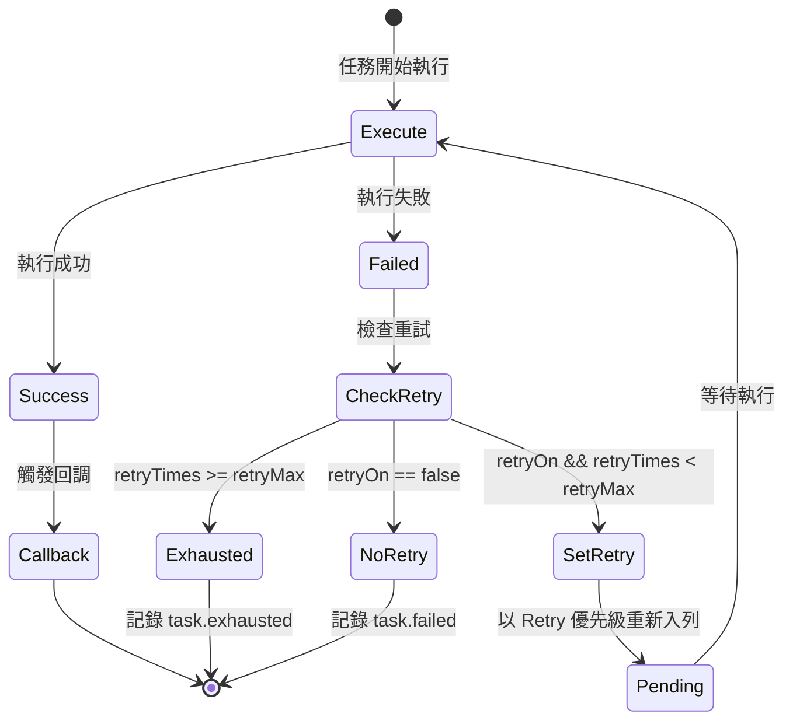

# Go 任務佇列

> 輕量的 Golang 優先級佇列，支援有界併發、優先級提升、錯誤重試和優雅關閉。最大化硬體資源利用並防止系統過載<br>
> 適用於需要控制併發任務執行並支援優先級排程的場景 

[](https://pkg.go.dev/github.com/pardnchiu/go-queue)
[](https://goreportcard.com/report/github.com/pardnchiu/go-queue)
[](https://app.codecov.io/github/pardnchiu/go-queue/tree/master)
[](https://github.com/pardnchiu/go-queue/releases)
[](LICENSE)

- [四大核心特色](#四大核心特色)
    - [並發邊界](#並發邊界)
    - [優先級佇列與提升](#優先級)
    - [錯誤重試](#錯誤重試)
- [流程圖](#流程圖)
- [使用方法](#使用方法)
    - [安裝](#安裝)
    - [初始化](#初始化)
        - [基本使用](#基本使用)
        - [使用預設配置](#使用預設配置)
        - [使用選項](#使用選項)
        - [使用重試](#使用重試)
- [配置介紹](#配置介紹)
- [優先級等級](#優先級等級)
- [可用函式](#可用函式)
    - [佇列管理](#佇列管理)
    - [入列選項](#入列選項)
- [優先級提升](#優先級提升-1)
- [重試機制](#重試機制)
- [超時機制](#超時機制)
- [使用場景](#使用場景)
- [授權條款](#授權條款)
- [作者](#作者)
- [星](#星)

## 四大核心特色

### 並發邊界
可配置大小的 Worker 池（預設：CPU 核心數 × 2）。超出 Worker 容量的任務會排隊等待，防止系統過載同時最大化硬體利用率。

### 優先級佇列與提升
使用最小堆實現的五級優先級系統（Immediate > High > Retry > Normal > Low）。高優先級任務優先執行，相同優先級的任務按 FIFO 順序處理。
長時間等待的任務會自動提升至更高優先級，防止飢餓。提升門檻根據配置的超時時間計算。

### 錯誤重試
任務失敗時可自動重試，重試任務以 `Retry` 優先級重新入列，介於 `High` 與 `Normal` 之間，實現延遲重試效果。

## 流程圖

<details>
<summary>主流程</summary>



</details>

<details>
<summary>優先級提升</summary>



</details>

<details>
<summary>重試流程</summary>



</details>

## 使用方法

### 安裝

> [!NOTE]
> 最新 commit 可能會變動，建議使用標籤版本<br>
> 針對僅包含文檔更新等非功能改動的 commit，後續會進行 rebase

```bash
go get github.com/pardnchiu/go-queue@[VERSION]

git clone --depth 1 --branch [VERSION] https://github.com/pardnchiu/go-queue.git
```

### 初始化

#### 基本使用
```go
package main

import (
  "context"
  "fmt"
  "time"
  
  queue "github.com/pardnchiu/go-queue"
)

func main() {
  // 使用預設配置初始化
  q := queue.New(nil)
  
  // 啟動佇列 workers
  ctx := context.Background()
  q.Start(ctx)
  
  // 入列任務
  for i := 0; i < 10; i++ {
    id, err := q.Enqueue(ctx, "", func(ctx context.Context) error {
      fmt.Println("任務已執行")
      return nil
    })
    if err != nil {
      fmt.Printf("入列失敗: %v\n", err)
    }
    fmt.Printf("任務 ID: %s\n", id)
  }
  
  // 優雅關閉（等待所有任務完成）
  if err := q.Shutdown(ctx); err != nil {
    fmt.Printf("關閉錯誤: %v\n", err)
  }
}
```

#### 使用預設配置
```go
package main

import (
  "context"
  "fmt"
  
  queue "github.com/pardnchiu/go-queue"
)

func main() {
  q := queue.New(&queue.Config{
    Workers: 8,
    Size:    1000,
    Timeout: 60,
    Preset: map[string]queue.PresetConfig{
      "critical": {Priority: "immediate", Timeout: 15},
      "email":    {Priority: "high", Timeout: 30},
      "report":   {Priority: "normal", Timeout: 120},
      "cleanup":  {Priority: "low", Timeout: 300},
    },
  })
  
  ctx := context.Background()
  q.Start(ctx)
  defer q.Shutdown(ctx)
  
  // 使用預設配置處理關鍵支付
  q.Enqueue(ctx, "critical", func(ctx context.Context) error {
    return processPayment()
  })
  
  // 使用預設配置發送郵件
  q.Enqueue(ctx, "email", func(ctx context.Context) error {
    return sendNotification()
  })
  
  // 使用預設配置生成報表
  q.Enqueue(ctx, "report", func(ctx context.Context) error {
    return generateReport()
  })
}
```

#### 使用選項
```go
package main

import (
  "context"
  "fmt"
  "time"
  
  queue "github.com/pardnchiu/go-queue"
)

func main() {
  q := queue.New(&queue.Config{Workers: 4})
  
  ctx := context.Background()
  q.Start(ctx)
  defer q.Shutdown(ctx)
  
  // 自訂任務 ID
  q.Enqueue(ctx, "", func(ctx context.Context) error {
    return processOrder("ORD-123")
  }, queue.WithTaskID("order-ORD-123"))
  
  // 自訂超時
  q.Enqueue(ctx, "", func(ctx context.Context) error {
    return heavyComputation()
  }, queue.WithTimeout(5*time.Minute))
  
  // 自訂回調（僅成功時觸發）
  q.Enqueue(ctx, "", func(ctx context.Context) error {
    return sendEmail()
  }, queue.WithCallback(func(id string) {
    fmt.Printf("任務 %s 完成\n", id)
  }))
  
  // 組合選項
  q.Enqueue(ctx, "", func(ctx context.Context) error {
    return importData()
  },
    queue.WithTaskID("import-daily"),
    queue.WithTimeout(10*time.Minute),
    queue.WithCallback(func(id string) {
      logSuccess(id)
    }),
  )
}
```

#### 使用重試
```go
package main

import (
  "context"
  "fmt"
  
  queue "github.com/pardnchiu/go-queue"
)

func main() {
  q := queue.New(&queue.Config{Workers: 4})
  
  ctx := context.Background()
  q.Start(ctx)
  defer q.Shutdown(ctx)
  
  // 啟用重試，使用預設最大次數（3 次）
  q.Enqueue(ctx, "", func(ctx context.Context) error {
    return callExternalAPI()
  }, queue.WithRetry(nil))
  
  // 啟用重試，指定最大次數
  maxRetry := 5
  q.Enqueue(ctx, "", func(ctx context.Context) error {
    return unreliableOperation()
  }, queue.WithRetry(&maxRetry))
  
  // 組合重試與回調
  q.Enqueue(ctx, "", func(ctx context.Context) error {
    return sendWebhook()
  },
    queue.WithRetry(nil),
    queue.WithCallback(func(id string) {
      fmt.Printf("任務 %s 最終成功\n", id)
    }),
  )
}
```

## 配置介紹

```go
type Config struct {
  Workers int                     // Worker 池大小（預設：CPU 核心數 × 2）
  Size    int                     // 最大佇列容量（預設：Workers × 64）
  Timeout int                     // 預設超時秒數（預設：30）
  Preset  map[string]PresetConfig // 命名預設配置
}

type PresetConfig struct {
  Priority string // "immediate"、"high"、"normal"、"low"（預設："normal"）
  Timeout  int    // 覆蓋超時秒數（0 = 依優先級自動計算）
}
```

## 優先級等級

| 優先級 | 數值 | 超時計算 | 使用場景 |
|--------|------|----------|----------|
| Immediate | 0 | timeout / 4（15-120s）| 支付、緊急告警 |
| High | 1 | timeout / 2（15-120s）| 用戶端操作 |
| Retry | 2 | timeout / 2（15-120s）| 失敗任務重試（系統內部使用）|
| Normal | 3 | timeout（15-120s）| 背景任務 |
| Low | 4 | timeout × 2（15-120s）| 清理、分析 |

> **注意**：`Retry` 優先級由系統內部管理，使用者無法直接指定。

## 可用函式

### 佇列管理

- `New(config)` - 建立新的佇列實例
  ```go
  q := queue.New(&queue.Config{
    Workers: 4,
    Size:    256,
    Timeout: 60,
  })
  ```

- `Start(ctx)` - 啟動 Worker 池
  ```go
  q.Start(ctx)
  ```

- `Enqueue(ctx, preset, action, options...)` - 將任務加入佇列
  ```go
  id, err := q.Enqueue(ctx, "email", func(ctx context.Context) error {
    return sendEmail()
  })
  ```

- `Shutdown(ctx)` - 優雅關閉
  ```go
  // 無限等待所有任務完成
  err := q.Shutdown(context.Background())
  
  // 帶超時
  ctx, cancel := context.WithTimeout(context.Background(), 30*time.Second)
  defer cancel()
  err := q.Shutdown(ctx)
  ```

### 入列選項

- `WithTaskID(id)` - 設定自訂任務 ID
  ```go
  queue.WithTaskID("unique-task-id")
  ```

- `WithTimeout(duration)` - 設定任務超時
  ```go
  queue.WithTimeout(5 * time.Minute)
  ```

- `WithCallback(fn)` - 設定完成回調（僅成功時觸發）
  ```go
  queue.WithCallback(func(id string) {
    // 任務成功完成後非同步呼叫
  })
  ```

- `WithRetry(maxRetry)` - 啟用錯誤重試
  ```go
  // 使用預設最大次數（3 次）
  queue.WithRetry(nil)
  
  // 指定最大次數
  maxRetry := 5
  queue.WithRetry(&maxRetry)
  ```

## 優先級提升

佇列中等待的任務會自動提升以防止飢餓：

| 原始優先級 | 提升目標 | 等待門檻 |
|------------|----------|----------|
| Low | Normal | clamp(timeout, 30s, 120s) |
| Normal | High | clamp(timeout × 2, 30s, 120s) |
| Retry | - | 不提升（由重試機制管理）|
| High | - | 不提升（已是高優先級）|
| Immediate | - | 不提升（最高優先級）|

每次 Worker 從佇列取出任務時檢查提升。

## 重試機制

啟用 `WithRetry` 後，任務失敗時會自動重試：

| 階段 | 行為 |
|------|------|
| 失敗且 `retryTimes < retryMax` | 以 `Retry` 優先級重新入列 |
| 失敗且 `retryTimes >= retryMax` | 記錄 `task.exhausted`，終止任務 |
| 成功 | 觸發 callback（如有設定）|

**重試特性**：
- 重試任務優先級為 `Retry`，介於 `High` 與 `Normal` 之間
- 每次重試重設 `startAt`，進入佇列尾端（同優先級內）
- `Retry` 優先級不參與自動提升，避免干擾正常優先級排程
- 預設最大重試次數為 3，可透過 `WithRetry(&maxRetry)` 自訂

## 超時機制

- 每個任務根據優先級或明確配置擁有超時時間
- 使用 `WithTimeout` 覆蓋預設超時
- 超時時：
    - 任務 context 被取消
    - 記錄錯誤日誌
    - 若啟用重試，視為失敗並嘗試重試
    - 洩漏 goroutine 偵測（任務 5 秒內未回應取消則警告）

## 使用場景

| 場景 | 配置 |
|------|------|
| API 背景作業 | Workers: CPU×2, Timeout: 30s |
| 郵件/通知 | Priority: High, Timeout: 60s |
| 報表生成 | Priority: Normal, Timeout: 300s |
| 資料清理 | Priority: Low, Timeout: 600s |
| 支付處理 | Priority: Immediate, Timeout: 15s |
| 外部 API 呼叫 | WithRetry(nil), Timeout: 30s |
| Webhook 發送 | Priority: High, WithRetry(&5) |

**可搭配 [go-scheduler](https://github.com/pardnchiu/go-scheduler) 整合：**
```go
// Scheduler 觸發，Queue 控制併發
scheduler.Add("@every 1m", func() error {
  orders := db.GetPendingOrders()
  for _, o := range orders {
    queue.Enqueue(ctx, "order", func(ctx context.Context) error {
      return processOrder(o)
    }, queue.WithRetry(nil))
  }
  return nil
})
```

## 授權條款

此專案採用 [MIT](LICENSE) 授權條款。

## 作者


<h4 style="padding-top: 0">邱敬幃 Pardn Chiu</h4>

<a href="mailto:dev@pardn.io" target="_blank">
  
</a> <a href="https://linkedin.com/in/pardnchiu" target="_blank">
  
</a>

## 星

[](https://www.star-history.com/#pardnchiu/go-queue&Date)

***

©️ 2025 [邱敬幃 Pardn Chiu](https://pardn.io)