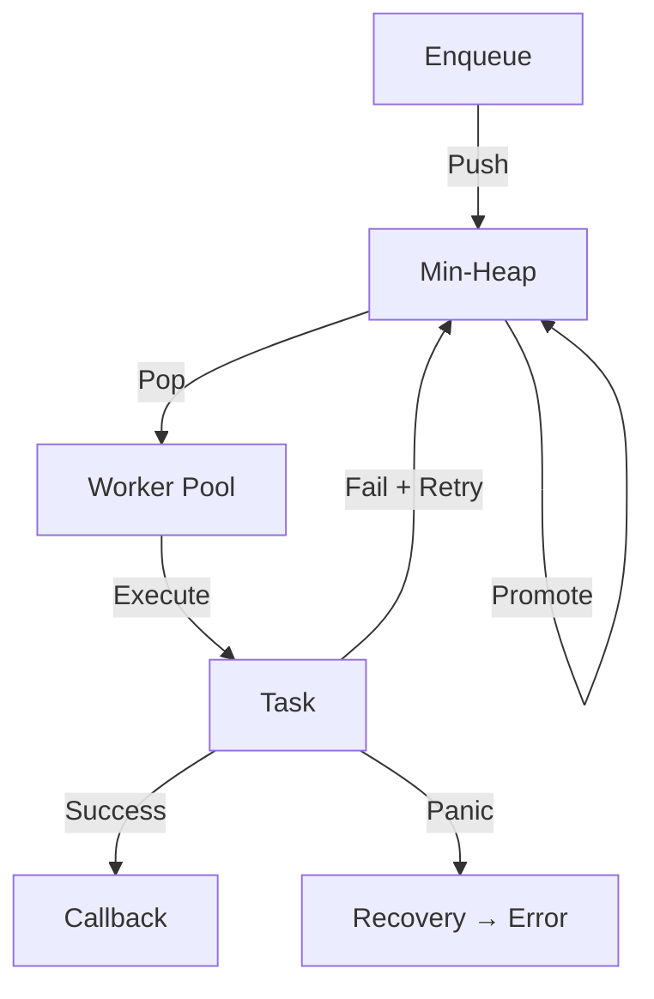

> [!NOTE]
> 此 README 由 [SKILL](https://github.com/pardnchiu/skill-readme-generate) 生成，英文版請參閱 [這裡](./README.md)。

# go-queue

[](https://pkg.go.dev/github.com/pardnchiu/go-queue)
[](https://goreportcard.com/report/github.com/pardnchiu/go-queue)
[](https://app.codecov.io/github/pardnchiu/go-queue/tree/master)
[](LICENSE)
[](https://github.com/pardnchiu/go-queue/releases)

> 基於 Min-Heap 的優先任務佇列，支援自動升級、Retry 與 Panic Recovery，專為 Go 併發場景設計。

## 目錄

- [功能特點](#功能特點)
- [架構](#架構)
- [檔案結構](#檔案結構)
- [授權](#授權)
- [Author](#author)
- [Stars](#stars)

## 功能特點

> `go get github.com/pardnchiu/go-queue` · [完整文件](./doc.zh.md)

### 五級優先排程與自動升級

任務依 Immediate、High、Retry、Normal、Low 五個等級透過 Min-Heap 排程，低優先任務在等待超過閾值後自動升級至更高等級，從根本上消除 Starvation 問題，無需手動干預。

### Atomic 狀態機驅動生命週期

佇列的 Created → Running → Closed 狀態轉換完全透過 `atomic.CompareAndSwap` 實現，避免在 Start 和 Shutdown 路徑上使用 Mutex，確保多個 Goroutine 同時操作時的安全性與低延遲。

### 內建 Retry 與 Panic Recovery

每個任務可配置獨立的重試次數上限，失敗後以 Retry 優先級重新入列。Worker 層自動攔截 Panic 並轉為錯誤回報，防止單一任務崩潰拖垮整個 Worker Pool。

## 架構


```mermaid
graph TB
    E[Enqueue] -->|Push| H[Min-Heap]
    H -->|Pop| W[Worker Pool]
    W -->|Execute| T[Task]
    T -->|Fail + Retry| H
    H -->|Promote| H
    T -->|Success| CB[Callback]
    T -->|Panic| R[Recovery → Error]
```

## 檔案結構

```
go-queue/
├── new.go              # 佇列建構、Worker 啟動與 Shutdown
├── task.go             # 任務結構與 Min-Heap 實作
├── pending.go          # 等待佇列、Push/Pop 與自動升級
├── priority.go         # 優先等級定義與 Timeout 計算
├── option.go           # Enqueue 選項（TaskID、Timeout、Callback、Retry）
├── main_test.go        # 測試
├── go.mod
└── LICENSE
```

## 授權

本專案採用 [MIT LICENSE](LICENSE)。

## Author


<h4 style="padding-top: 0">邱敬幃 Pardn Chiu</h4>

<a href="mailto:dev@pardn.io" target="_blank">

</a> <a href="https://linkedin.com/in/pardnchiu" target="_blank">

</a>

## Stars

[](https://www.star-history.com/#pardnchiu/go-queue&Date)

***

©️ 2025 [邱敬幃 Pardn Chiu](https://linkedin.com/in/pardnchiu)
