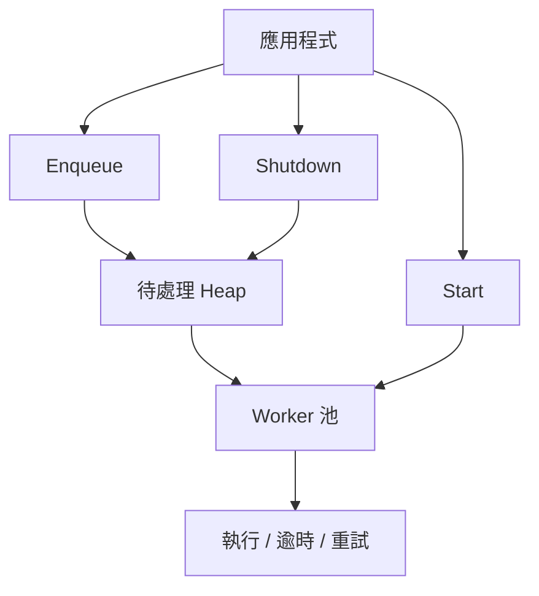

> [!NOTE]
> 此 README 由 [SKILL](https://github.com/agenvoy/skill-readme-generate) 生成，英文版請參閱 [這裡](../README.md)。

***

<strong>PRIORITY-AWARE TASK QUEUE FOR GO</strong>

***

> Go 任務佇列函式庫，具備優先級排程、逾時重試與原子狀態機

## 目錄

- [功能特點](#功能特點)
- [架構](#架構)
- [授權](#授權)
- [Author](#author)

## 功能特點

> `go get github.com/pardnchiu/go-queue` · [完整文件](./doc.zh.md)

- **五級優先佇列** — Immediate／High／Retry／Normal／Low 排序，低優先級逾時後自動晉升。
- **Worker 池並行** — 預設 CPU×2 個 worker，可調佇列容量與全域逾時。
- **逾時與重試** — 任務逾時、panic 隔離、可設定重試次數並以最高優先級重新入隊。
- **Functional Options** — WithTaskID、WithTimeout、WithCallback、WithRetry 彈性設定單次入隊。
- **原子狀態機** — Created／Running／Closed 以 CAS 轉換，冪等 Shutdown 且無 mutex 競爭。

## 架構

> [完整架構](./architecture.zh.md)

## 授權

本專案採用 [MIT LICENSE](../LICENSE)。

## Author

<h4 style="padding-top: 0">邱敬幃 Pardn Chiu</h4>

<a href="mailto:hi@pardn.io">hi@pardn.io</a> 
<a href="https://www.linkedin.com/in/pardnchiu">https://www.linkedin.com/in/pardnchiu</a>

***

©️ 2025 [邱敬幃 Pardn Chiu](https://www.linkedin.com/in/pardnchiu)
