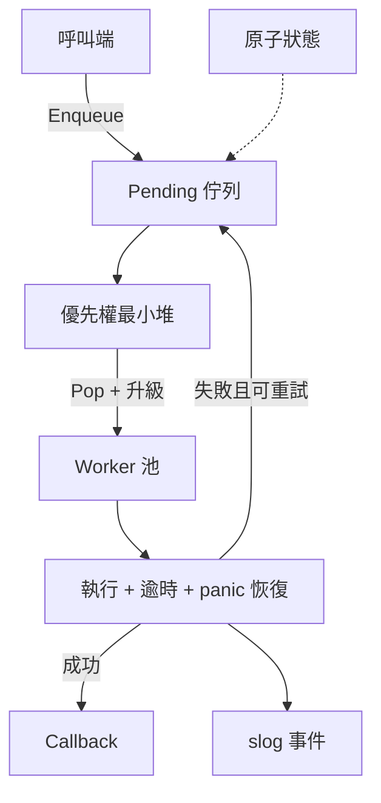

> [!NOTE]
> 此 README 由 [SKILL](https://github.com/agenvoy/skill-readme-generate) 生成，英文版請參閱 [這裡](../README.md)。

***

<strong>PRIORITY TASKS THAT NEVER STARVE!</strong>

***

> Go 優先權任務佇列，具備防飢餓自動升級、依優先權縮放的逾時與優雅排空關閉

## 目錄

- [功能特點](#功能特點)
- [架構](#架構)
- [授權](#授權)
- [Author](#author)

## 功能特點

> `go get github.com/pardnchiu/go-queue` · [完整文件](./doc.zh.md)

- **五級優先權最小堆** — Immediate／High／Retry／Normal／Low 五個層級共用一個最小堆，同級依入列時間先進先出。
- **防飢餓自動升級** — Low 與 Normal 任務等待超過門檻後自動升級，高優先權流量再密集也不會讓低優先權任務永遠排不到。
- **Preset 驅動的逾時** — 以具名 Preset 綁定優先權與基準逾時，實際逾時依優先權縮放並限制在 15–120 秒之間。
- **重試與 panic 隔離** — 失敗任務以專屬 Retry 優先權重新入列，任務內的 panic 被轉為錯誤，不會拖垮 Worker 池（Pool）。
- **原子狀態生命週期** — Created → Running → Closed 由 CAS 驅動，`Shutdown` 會排空剩餘任務並支援期限控制。

## 架構

> [完整架構](./architecture.zh.md)

```mermaid
graph TB
    C[呼叫端] -->|Enqueue| P[Pending 佇列]
    P --> H[優先權最小堆]
    H -->|Pop + 升級| W[Worker 池]
    W --> E[執行 + 逾時 + panic 恢復]
    E -->|失敗且可重試| P
    E -->|成功| CB[Callback]
    E --> L[slog 事件]
    S[原子狀態] -.-> P
```

## 授權

本專案採用 [MIT LICENSE](../LICENSE)。

## Author

Just [open an issue](https://github.com/pardnchiu/go-queue/issues/new) to share an idea.

***

©️ 2025 [邱敬幃 Pardn Chiu](https://www.linkedin.com/in/pardnchiu)
