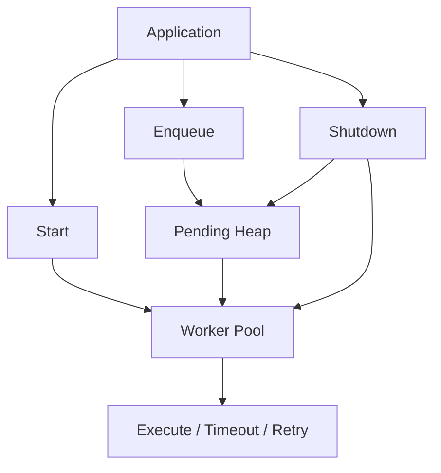
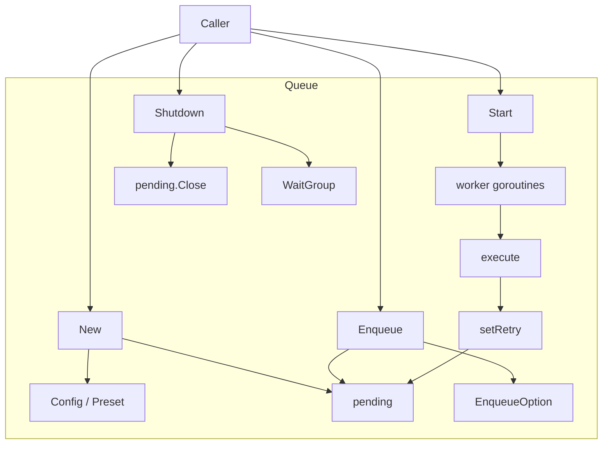
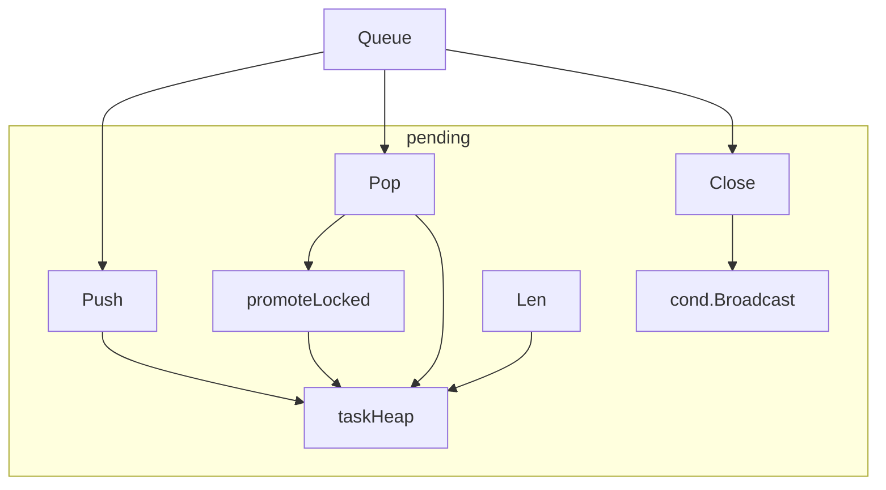
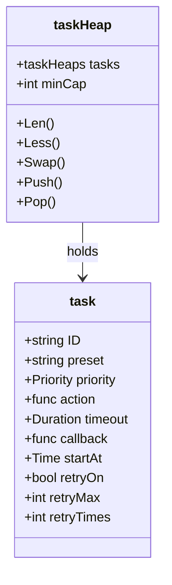
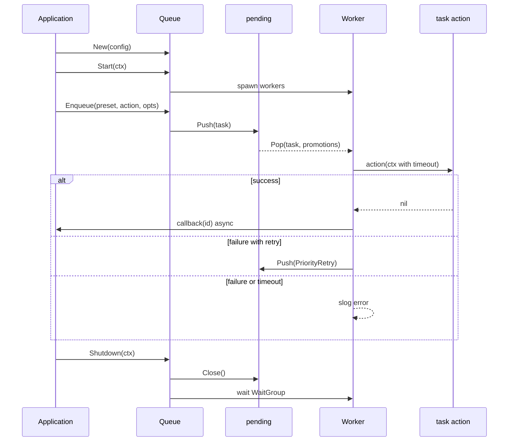
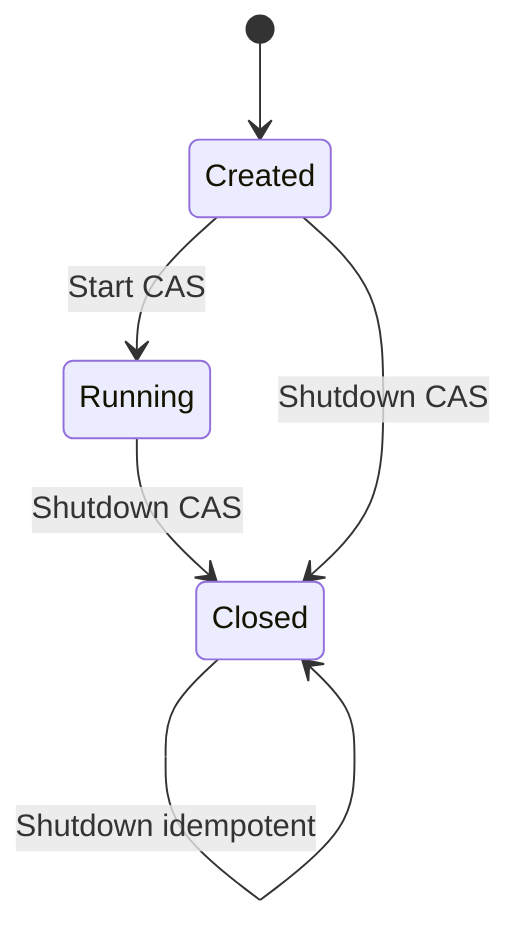

# go-queue - Architecture

> Back to [README](../README.md)

## Overview

## Module: Queue

Public API and lifecycle entry point. Owns config, pending queue, and worker coordination.

## Module: pending

Mutex + condition-variable protected priority queue with promotion and close broadcast.

## Module: taskHeap

`container/heap` ordered by priority then `startAt`, with capacity shrink on pop.

## Data Flow

## State Machine

***

©️ 2025 [邱敬幃 Pardn Chiu](https://www.linkedin.com/in/pardnchiu)
