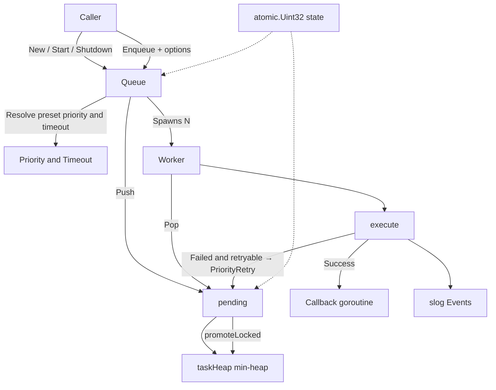
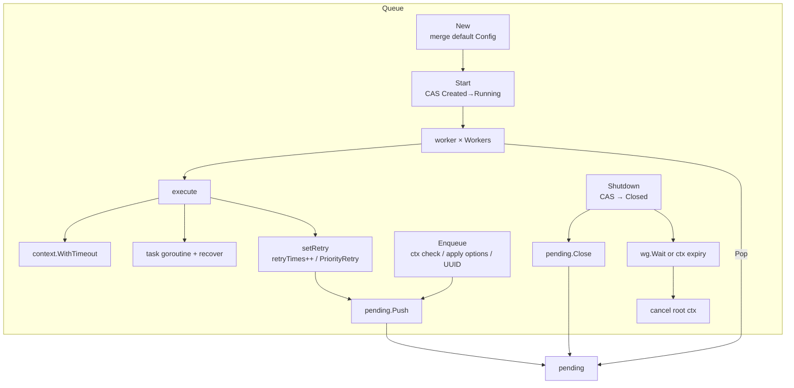
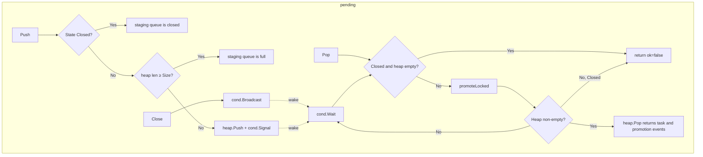
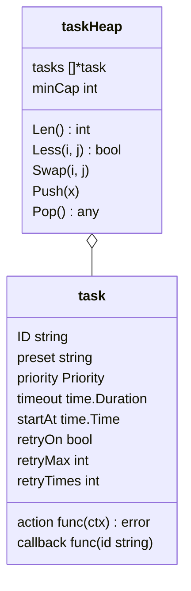
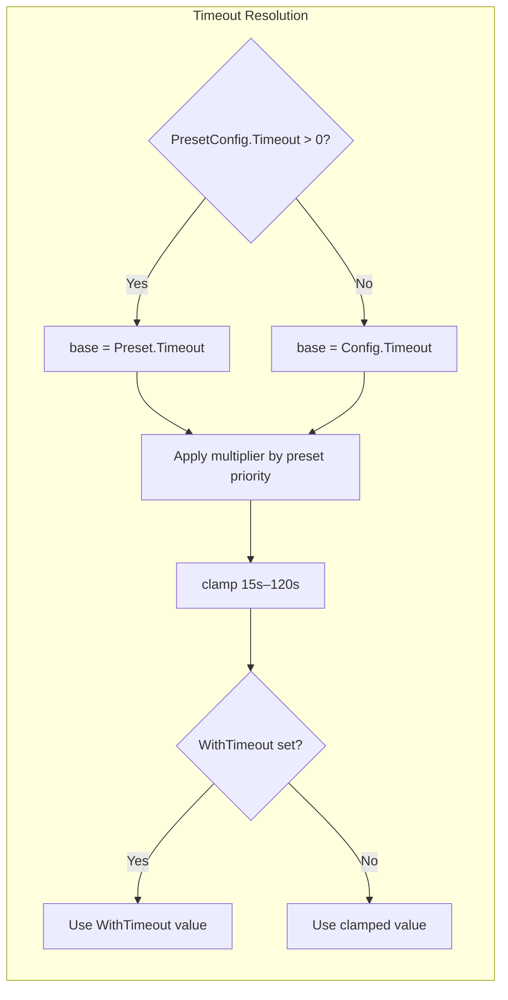
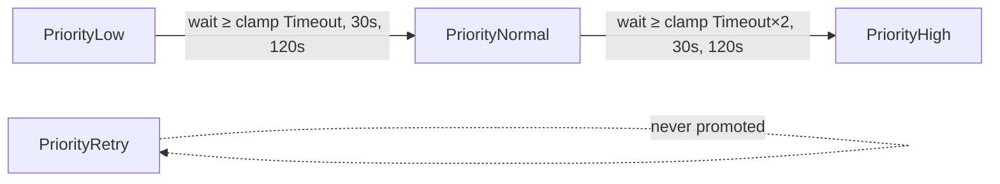
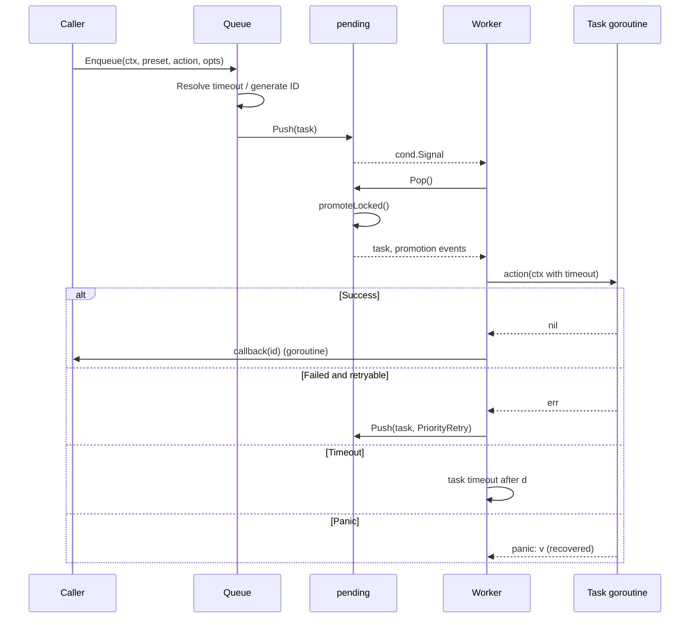
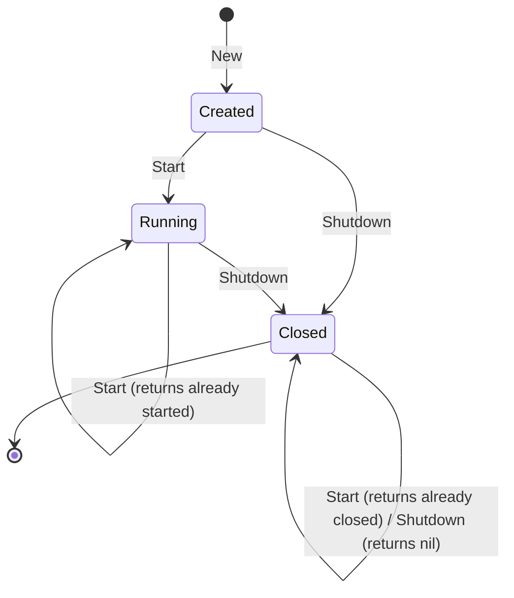
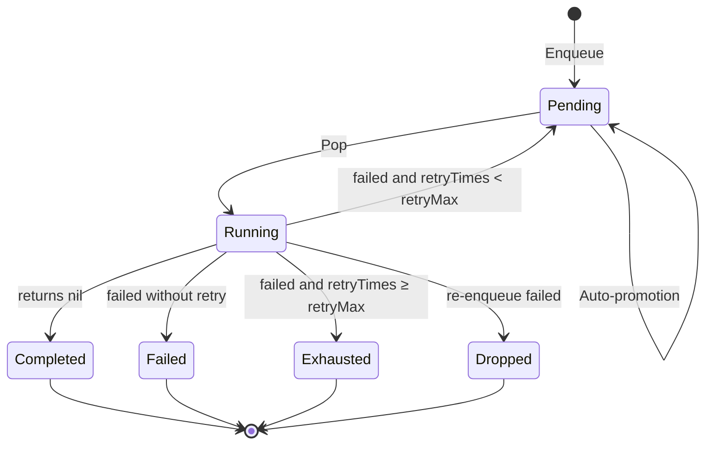

# go-queue - Architecture

> Back to [README](../README.md)

## Overview

```mermaid
graph TB
    C[Caller] -->|New / Start / Shutdown| Q[Queue]
    C -->|Enqueue + options| Q
    Q -->|Resolve preset priority and timeout| PR[Priority and Timeout]
    Q -->|Push| P[pending]
    P --> H[taskHeap min-heap]
    P -->|promoteLocked| H
    Q -->|Spawns N| W[Worker]
    W -->|Pop| P
    W --> E[execute]
    E -->|Failed and retryable → PriorityRetry| P
    E -->|Success| CB[Callback goroutine]
    E --> L[slog Events]
    S[atomic.Uint32 state] -.-> Q
    S -.-> P
```

## Module: Queue

Owns the lifecycle, the worker pool, and single-task execution (timeout, panic recovery, retry decision).

```mermaid
graph TB
    subgraph Queue
        N[New<br/>merge default Config] --> ST[Start<br/>CAS Created→Running]
        ST --> WK[worker × Workers]
        WK --> EX[execute]
        EX --> TO[context.WithTimeout]
        EX --> GR[task goroutine + recover]
        EX --> RT[setRetry<br/>retryTimes++ / PriorityRetry]
        EQ[Enqueue<br/>ctx check / apply options / UUID] --> PU[pending.Push]
        SD[Shutdown<br/>CAS → Closed] --> CL[pending.Close]
        SD --> WG[wg.Wait or ctx expiry]
        WG --> CN[cancel root ctx]
    end
    RT --> PU
    WK -->|Pop| PD[pending]
    PU --> PD
    CL --> PD
```

## Module: pending

A bounded priority queue guarded by `sync.Mutex` + `sync.Cond` that enforces capacity, closure, and auto-promotion.

```mermaid
graph TB
    subgraph pending
        PS[Push] --> CK{State Closed?}
        CK -->|Yes| E1[staging queue is closed]
        CK -->|No| SZ{heap len ≥ Size?}
        SZ -->|Yes| E2[staging queue is full]
        SZ -->|No| HP[heap.Push + cond.Signal]
        PO[Pop] --> LP{Closed and heap empty?}
        LP -->|Yes| EXIT[return ok=false]
        LP -->|No| PM[promoteLocked]
        PM --> HN{Heap non-empty?}
        HN -->|Yes| POP[heap.Pop returns task and promotion events]
        HN -->|No, Closed| EXIT
        HN -->|No| WT[cond.Wait]
        WT --> LP
        CLS[Close] --> BC[cond.Broadcast]
    end
    BC -.->|wake| WT
    HP -.->|wake| WT
```

## Module: taskHeap

A min-heap implementing `container/heap.Interface` that shrinks its backing slice when length falls far below capacity.

```mermaid
classDiagram
    class task {
        ID string
        preset string
        priority Priority
        action func(ctx) error
        timeout time.Duration
        callback func(id string)
        startAt time.Time
        retryOn bool
        retryMax int
        retryTimes int
    }
    class taskHeap {
        tasks []*task
        minCap int
        Len() int
        Less(i, j) bool
        Swap(i, j)
        Push(x)
        Pop() any
    }
    taskHeap o-- task
```

| Rule | Detail |
|------|--------|
| Ordering | Lower `priority` first; ties break on earlier `startAt` |
| Shrink condition | `cap > minCap × 4` and `len < cap / 8` |
| Shrink target | `max(cap / 4, minCap)` |
| `minCap` | `max(16, min(Size / 8, Size / Workers))` |

## Module: Priority and Timeout

Two derivations on `Config`: `getQueueTimeout` fixes a task's timeout at enqueue, and `getPromotion` fixes promotion thresholds at construction.

```mermaid
graph LR
    subgraph Timeout Resolution
        B{PresetConfig.Timeout > 0?} -->|Yes| B1[base = Preset.Timeout]
        B -->|No| B2[base = Config.Timeout]
        B1 --> M[Apply multiplier by preset priority]
        B2 --> M
        M --> CP[clamp 15s–120s]
        CP --> O{WithTimeout set?}
        O -->|Yes| OV[Use WithTimeout value]
        O -->|No| RS[Use clamped value]
    end
```

```mermaid
graph LR
    L[PriorityLow] -->|wait ≥ clamp Timeout, 30s, 120s| N[PriorityNormal]
    N -->|wait ≥ clamp Timeout×2, 30s, 120s| H[PriorityHigh]
    R[PriorityRetry] -.->|never promoted| R
```

## Data Flow

```mermaid
sequenceDiagram
    participant C as Caller
    participant Q as Queue
    participant P as pending
    participant W as Worker
    participant T as Task goroutine
    C->>Q: Enqueue(ctx, preset, action, opts)
    Q->>Q: Resolve timeout / generate ID
    Q->>P: Push(task)
    P-->>W: cond.Signal
    W->>P: Pop()
    P->>P: promoteLocked()
    P-->>W: task, promotion events
    W->>T: action(ctx with timeout)
    alt Success
        T-->>W: nil
        W->>C: callback(id) (goroutine)
    else Failed and retryable
        T-->>W: err
        W->>P: Push(task, PriorityRetry)
    else Timeout
        W->>W: task timeout after d
    else Panic
        T-->>W: panic: v (recovered)
    end
```

## State Machine

### Queue Lifecycle

```mermaid
stateDiagram-v2
    [*] --> Created: New
    Created --> Running: Start
    Created --> Closed: Shutdown
    Running --> Closed: Shutdown
    Running --> Running: Start (returns already started)
    Closed --> Closed: Start (returns already closed) / Shutdown (returns nil)
    Closed --> [*]
```

### Task Lifecycle

```mermaid
stateDiagram-v2
    [*] --> Pending: Enqueue
    Pending --> Pending: Auto-promotion
    Pending --> Running: Pop
    Running --> Completed: returns nil
    Running --> Pending: failed and retryTimes < retryMax
    Running --> Failed: failed without retry
    Running --> Exhausted: failed and retryTimes ≥ retryMax
    Running --> Dropped: re-enqueue failed
    Completed --> [*]
    Failed --> [*]
    Exhausted --> [*]
    Dropped --> [*]
```

***

©️ 2025 [邱敬幃 Pardn Chiu](https://www.linkedin.com/in/pardnchiu)
