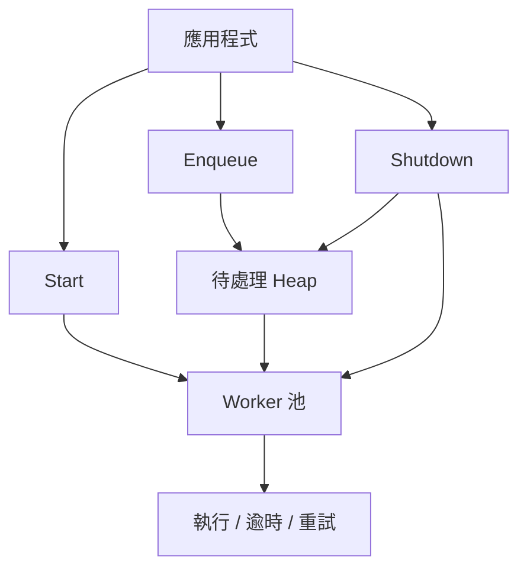
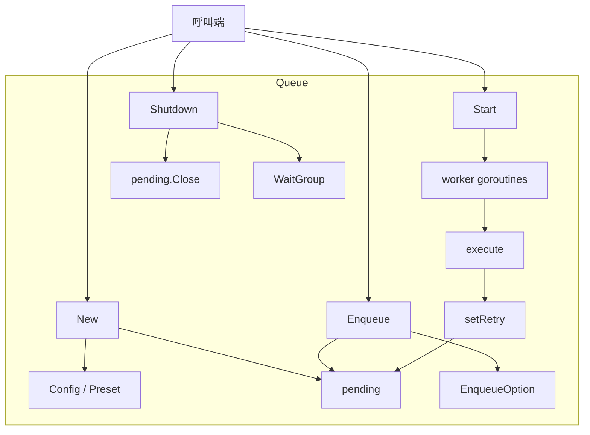
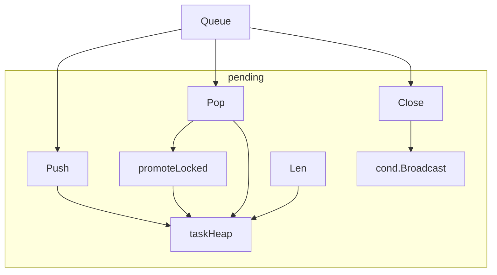
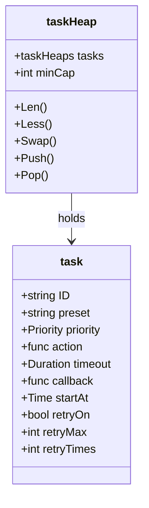
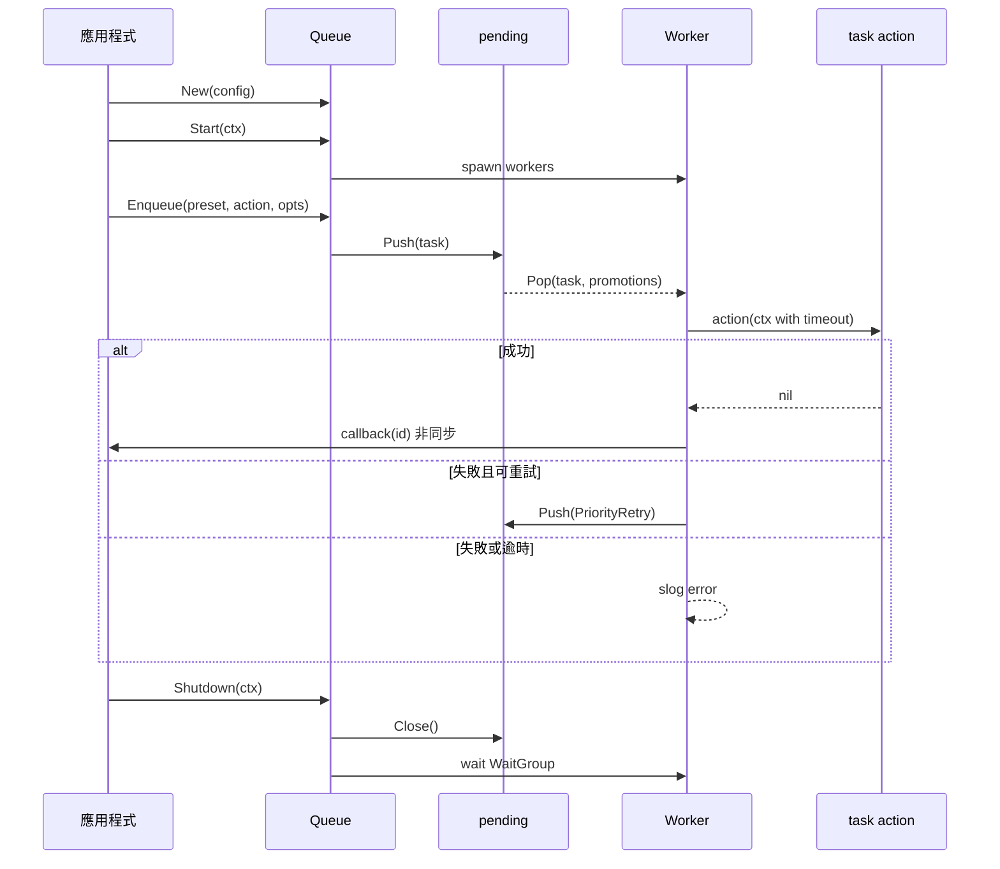
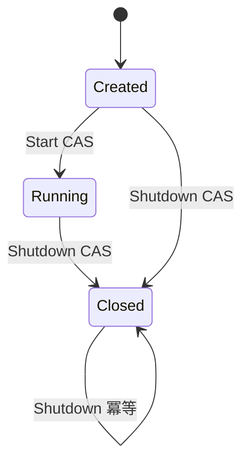

# go-queue - 架構

> 返回 [README](./README.zh.md)

## 概覽

## Module: Queue

對外 API 與生命週期入口，持有設定、pending 佇列與 worker 協調。

## Module: pending

以 mutex + cond 保護的優先佇列，支援晉升與關閉廣播。

## Module: taskHeap

`container/heap` 實作，依 priority 再依 startAt 排序，並在縮減時回收容量。

## 資料流

## 狀態機

***

©️ 2025 [邱敬幃 Pardn Chiu](https://www.linkedin.com/in/pardnchiu)
