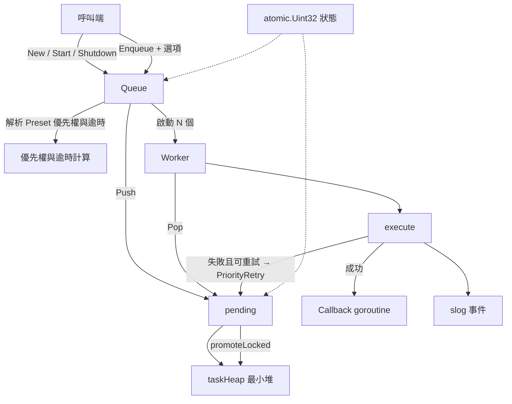
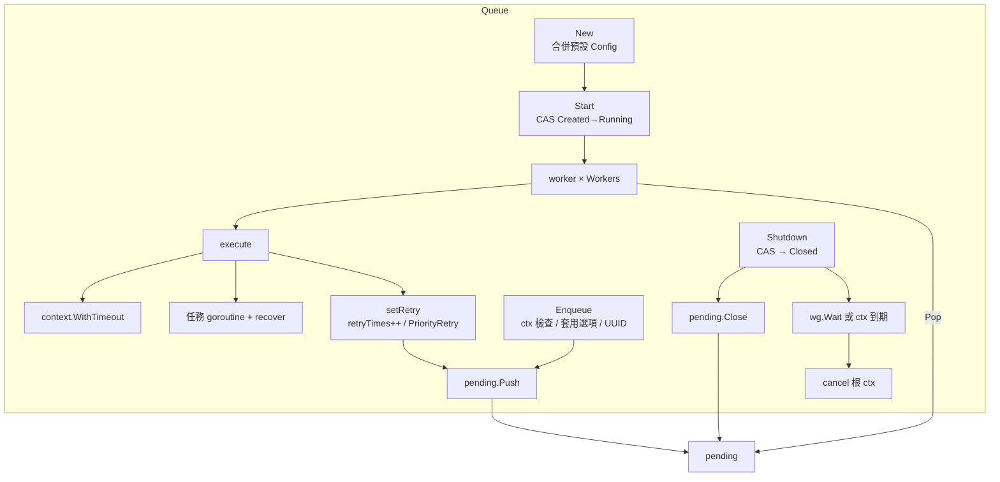
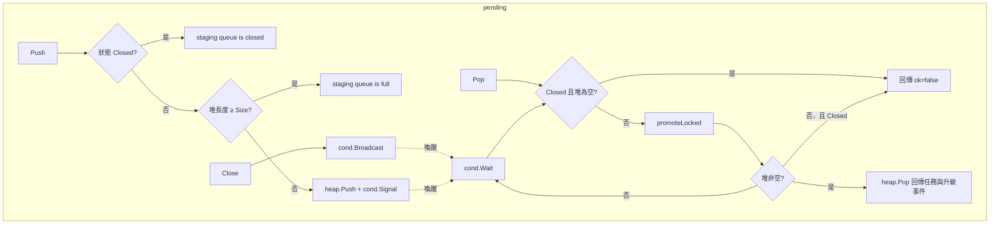
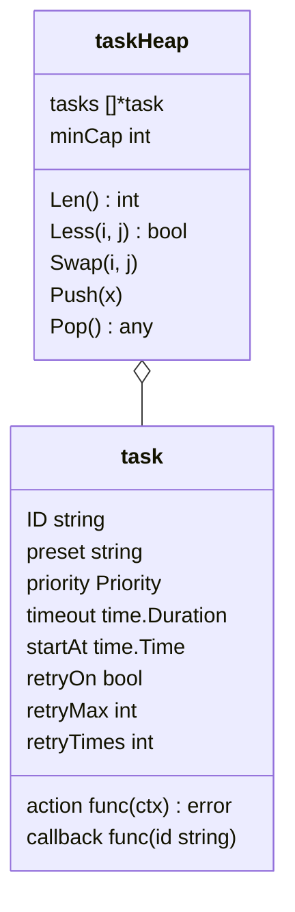
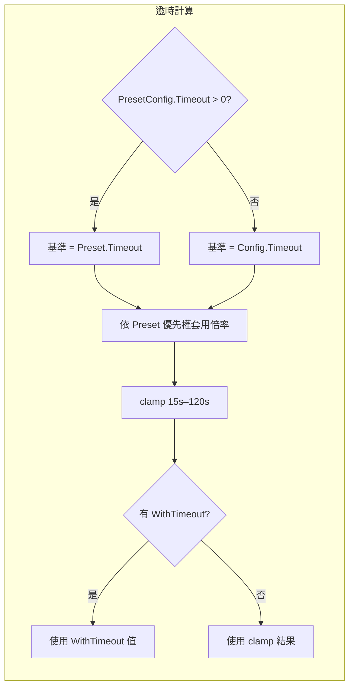
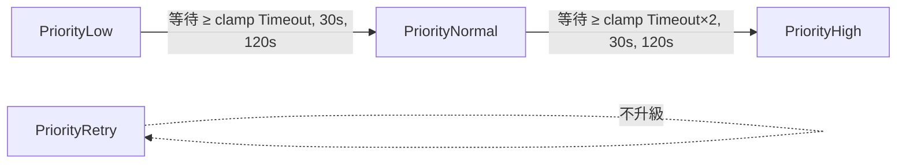
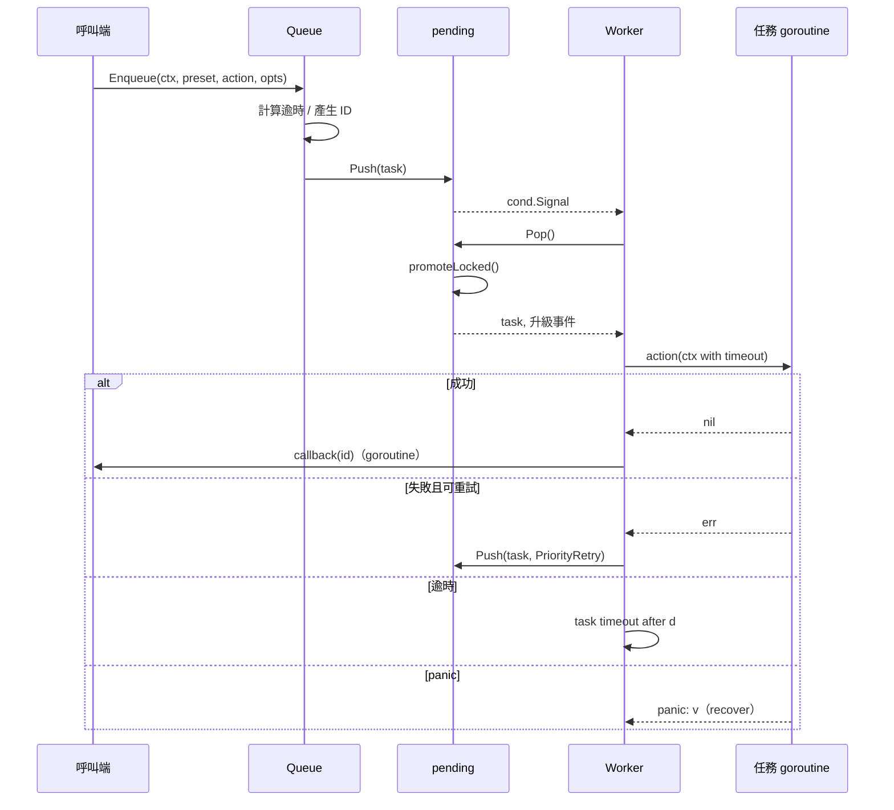
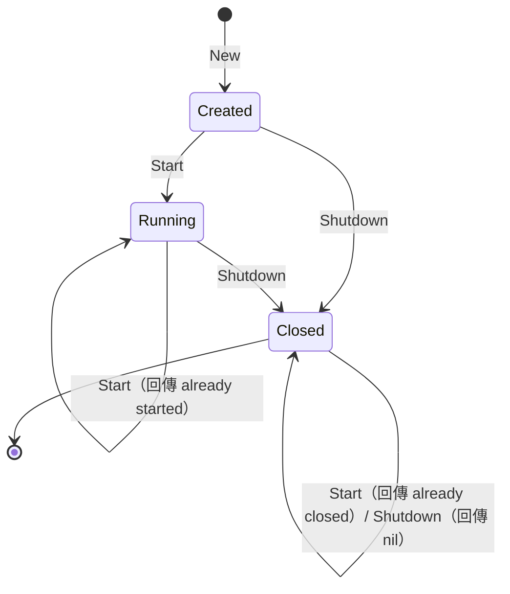
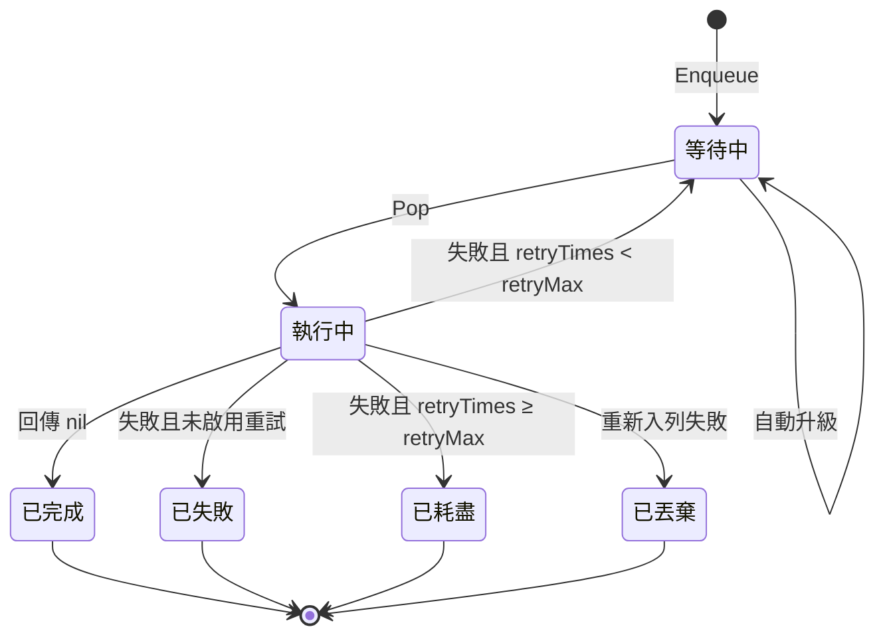

# go-queue - 架構

> 返回 [README](./README.zh.md)

## 概覽

```mermaid
graph TB
    C[呼叫端] -->|New / Start / Shutdown| Q[Queue]
    C -->|Enqueue + 選項| Q
    Q -->|解析 Preset 優先權與逾時| PR[優先權與逾時計算]
    Q -->|Push| P[pending]
    P --> H[taskHeap 最小堆]
    P -->|promoteLocked| H
    Q -->|啟動 N 個| W[Worker]
    W -->|Pop| P
    W --> E[execute]
    E -->|失敗且可重試 → PriorityRetry| P
    E -->|成功| CB[Callback goroutine]
    E --> L[slog 事件]
    S[atomic.Uint32 狀態] -.-> Q
    S -.-> P
```

## Module: Queue

負責生命週期、Worker 池與單一任務的執行（逾時、panic 恢復、重試判斷）。

```mermaid
graph TB
    subgraph Queue
        N[New<br/>合併預設 Config] --> ST[Start<br/>CAS Created→Running]
        ST --> WK[worker × Workers]
        WK --> EX[execute]
        EX --> TO[context.WithTimeout]
        EX --> GR[任務 goroutine + recover]
        EX --> RT[setRetry<br/>retryTimes++ / PriorityRetry]
        EQ[Enqueue<br/>ctx 檢查 / 套用選項 / UUID] --> PU[pending.Push]
        SD[Shutdown<br/>CAS → Closed] --> CL[pending.Close]
        SD --> WG[wg.Wait 或 ctx 到期]
        WG --> CN[cancel 根 ctx]
    end
    RT --> PU
    WK -->|Pop| PD[pending]
    PU --> PD
    CL --> PD
```

## Module: pending

以 `sync.Mutex` + `sync.Cond` 保護的有界優先權佇列，負責容量控制、關閉判斷與自動升級。

```mermaid
graph TB
    subgraph pending
        PS[Push] --> CK{狀態 Closed?}
        CK -->|是| E1[staging queue is closed]
        CK -->|否| SZ{堆長度 ≥ Size?}
        SZ -->|是| E2[staging queue is full]
        SZ -->|否| HP[heap.Push + cond.Signal]
        PO[Pop] --> LP{Closed 且堆為空?}
        LP -->|是| EXIT[回傳 ok=false]
        LP -->|否| PM[promoteLocked]
        PM --> HN{堆非空?}
        HN -->|是| POP[heap.Pop 回傳任務與升級事件]
        HN -->|否，且 Closed| EXIT
        HN -->|否| WT[cond.Wait]
        WT --> LP
        CLS[Close] --> BC[cond.Broadcast]
    end
    BC -.->|喚醒| WT
    HP -.->|喚醒| WT
```

## Module: taskHeap

實作 `container/heap.Interface` 的最小堆，並在長度遠低於容量時縮減底層 slice。

```mermaid
classDiagram
    class task {
        ID string
        preset string
        priority Priority
        action func(ctx) error
        timeout time.Duration
        callback func(id string)
        startAt time.Time
        retryOn bool
        retryMax int
        retryTimes int
    }
    class taskHeap {
        tasks []*task
        minCap int
        Len() int
        Less(i, j) bool
        Swap(i, j)
        Push(x)
        Pop() any
    }
    taskHeap o-- task
```

| 規則 | 內容 |
|------|------|
| 排序 | `priority` 小者優先；相同時 `startAt` 早者優先 |
| 縮減條件 | `cap > minCap × 4` 且 `len < cap / 8` |
| 縮減目標 | `max(cap / 4, minCap)` |
| `minCap` | `max(16, min(Size / 8, Size / Workers))` |

## Module: 優先權與逾時

`Config` 的兩個推導函式：`getQueueTimeout` 於入列時決定任務逾時，`getPromotion` 於建構時決定升級門檻。

```mermaid
graph LR
    subgraph 逾時計算
        B{PresetConfig.Timeout > 0?} -->|是| B1[基準 = Preset.Timeout]
        B -->|否| B2[基準 = Config.Timeout]
        B1 --> M[依 Preset 優先權套用倍率]
        B2 --> M
        M --> CP[clamp 15s–120s]
        CP --> O{有 WithTimeout?}
        O -->|是| OV[使用 WithTimeout 值]
        O -->|否| RS[使用 clamp 結果]
    end
```

```mermaid
graph LR
    L[PriorityLow] -->|等待 ≥ clamp Timeout, 30s, 120s| N[PriorityNormal]
    N -->|等待 ≥ clamp Timeout×2, 30s, 120s| H[PriorityHigh]
    R[PriorityRetry] -.->|不升級| R
```

## 資料流

```mermaid
sequenceDiagram
    participant C as 呼叫端
    participant Q as Queue
    participant P as pending
    participant W as Worker
    participant T as 任務 goroutine
    C->>Q: Enqueue(ctx, preset, action, opts)
    Q->>Q: 計算逾時 / 產生 ID
    Q->>P: Push(task)
    P-->>W: cond.Signal
    W->>P: Pop()
    P->>P: promoteLocked()
    P-->>W: task, 升級事件
    W->>T: action(ctx with timeout)
    alt 成功
        T-->>W: nil
        W->>C: callback(id)（goroutine）
    else 失敗且可重試
        T-->>W: err
        W->>P: Push(task, PriorityRetry)
    else 逾時
        W->>W: task timeout after d
    else panic
        T-->>W: panic: v（recover）
    end
```

## 狀態機

### Queue 生命週期

```mermaid
stateDiagram-v2
    [*] --> Created: New
    Created --> Running: Start
    Created --> Closed: Shutdown
    Running --> Closed: Shutdown
    Running --> Running: Start（回傳 already started）
    Closed --> Closed: Start（回傳 already closed）/ Shutdown（回傳 nil）
    Closed --> [*]
```

### 任務生命週期

```mermaid
stateDiagram-v2
    [*] --> 等待中: Enqueue
    等待中 --> 等待中: 自動升級
    等待中 --> 執行中: Pop
    執行中 --> 已完成: 回傳 nil
    執行中 --> 等待中: 失敗且 retryTimes < retryMax
    執行中 --> 已失敗: 失敗且未啟用重試
    執行中 --> 已耗盡: 失敗且 retryTimes ≥ retryMax
    執行中 --> 已丟棄: 重新入列失敗
    已完成 --> [*]
    已失敗 --> [*]
    已耗盡 --> [*]
    已丟棄 --> [*]
```

***

©️ 2025 [邱敬幃 Pardn Chiu](https://www.linkedin.com/in/pardnchiu)
